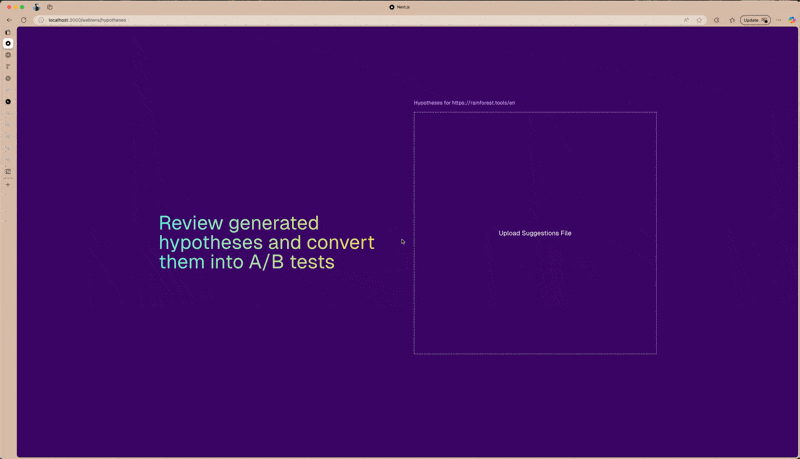

# Frontend Interview Challenge


## Requirements

- You must use Next.js and Tailwind CSS to build the project.

- You may use any additional libraries, **but UI libraries that do not integrate with Tailwind CSS are not allowed.**

- The project should follow the same theme as the [Venue theme](https://venue-theme-morning.myshopify.com/).

  - Images are not important—you may use placeholder images. however, the product page should have a product image which we have provided in the assets folder.

- Product data will be provided in the assets folder.

- While this is a frontend-focused challenge, you should write backend code if necessary (e.g., for SSR/SSG or handling API requests).

- Deploy the project to a publicly accessible URL.

- Extra features that go beyond the requirements and impress us are encouraged!

## Project Description

This is a minimalistic e-commerce project built using Next.js and Tailwind CSS.

### Task 1: E-Commerce Website

Build an e-commerce website that includes the following pages:

- [Home page](https://venue-theme-morning.myshopify.com/)
- [Product page](https://venue-theme-morning.myshopify.com/collections/accessories/products/copy-of-drift-hat)
- [Collection page](https://venue-theme-morning.myshopify.com/collections/accessories)

> - [GitHub Repo](https://github.com/rainforest-dev/abconvert-frontend-interview-question)
> - [Live URL](https://abconvert-frontend-interview-question.vercel.app/)
> - 

#### Project Structure

```
src/
├── components/: components that can be reused across the website
│   ├── Header.tsx
│   ├── Footer.tsx
│   └── ...
├── app/: put components specific for the routes here next to the route used them.
│   ├── layout.tsx: fonts, global styles, and metadata
│   ├── (e-commerce): routes for task 1
│   │   ├── page.tsx: home page
│   │   ├── collections/[name]/page.tsx: collection pages
│   │   └── products/[id]/page.tsx: product pages
│   ├── (weblens): routes for task 2
│   │   └── weblens
│   │       ├── hypotheses/page.tsx: page to upload suggestions.json
│   │       └── page.tsx: currently cannot analyze url via backend endpoint, so this route is not functional
│   ├── globals.css: global styles and tailwind css configurations
│   └── ...
├── utils/: utility functions and constants
├── types/: type definitions
assets/
├── product.json: JSON file containing product data
public/
├── images/
├── product-images/
│   ├── product1.jpg
│   ├── product2.jpg
│   └── ...
└── ...
```

#### Development Locally

To run the project locally, follow these steps:

```bash
npm i
npm run dev
```

### Bonus Task: A/B Test Recommendation Engine

Create an A/B test recommendation engine that suggests the best recommendations for users.

- The implementation should replicate the functionality of [Weblens AI](https://weblens.ai/).

- Concrete system flow:

  - Implement a system to scrape a your website which you built in the first task.
  - Utilize AI to determine if there are any elements suitable for A/B testing.
  - Develop an effective method to present the results.

- You may implement this using a CLI tool, scripts, APIs, or any other method.

We highly recommend you complete this task.

#### Analysis Tool

##### Folder Structure

```
.
├── scripts
│   ├──crawler.ts: Crawls the website and extracts relevant data. (HTML and screenshot)
│   ├──analyze.ts: Analyzes the extracted data and determines suitable elements for A/B testing.
│   │               Currently support Ollama and OpenAI(Recommended)
│   └── index.ts: Main entry point powered by @clack/prompts
└── .env.local: put api urls, api keys and some other configurations here.
```

##### Usage

```bash
npx jiti ./scripts/index.ts
```

```
node ➜ /workspaces/abconvert-frontend-interview-question (main) $ npx jiti ./scripts/index.ts
┌  A/B Testing Suggestions Generator
│
◆  Enter the URL of the page you want to generate A/B testing suggestions for:
│  _
◇  Enter the URL of the page you want to generate A/B testing suggestions for:
│  https://rainforest.tools/en
│
◇  Choose a language model to analyze the content:
│  gpt-4o-mini
│
◇  Page crawled successfully. Content length: 25309 characters
│
◇  Analyzing the content
│
└  Suggestions saved to suggestions.json
```

#### Visualization of Suggestions

After running the script, you will find `suggestions.json` in the output directory. This file contains the A/B testing suggestions for the provided URL. Then go to [/weblens/hypotheses](https://abconvert-frontend-interview-question.vercel.app/weblens/hypotheses) and upload the `suggestions.json` file to view the A/B testing hypotheses.



## Evaluation criteria

### Requirement Fulfillment

- Does the project meet all the listed requirements?
- Are there any extra features that go above and beyond what we asked for?

### Code readability

- Are variable and function names meaningful and descriptive?
- Are naming conventions consistent throughout the project?
- Are comments clear and useful?
- Is the code properly formatted and structured?

### Code quality

- Are best practices followed in the project structure?
- Is the code efficient and maintainable?
- Are performance optimizations applied where necessary?
- Is the styling clean and consistent?
- Is the documentation clear and well-written?

### Code maintainability

- Does the project follow a consistent style guide?
- Is there clear documentation explaining the code?

### Code performance

- Does the project pass performance tests? (You can check using [PageSpeed Insights](https://pagespeed.web.dev/))
- While there is no minimum performance score, you should optimize the website as much as possible.

### Documentation

- Is there a well-structured README file?
- Does the documentation explain setup, usage, and key functionalities?
- Are installation and deployment instructions clear?
- Are API endpoints (if any) well-documented?

### Communication

- Can you explain your project clearly and concisely?
- Are questions or clarifications raised in a timely and professional manner?
- Are interactions with the point of contact clear and effective?

## Submission

Please submit the following to talent@abconvert.io.

1. A public GitHub repository with your project code.
2. A live URL.
3. A demo video showcasing your project

There is no strict deadline for this project; please submit it when you believe it is ready for review.
Good luck :)
